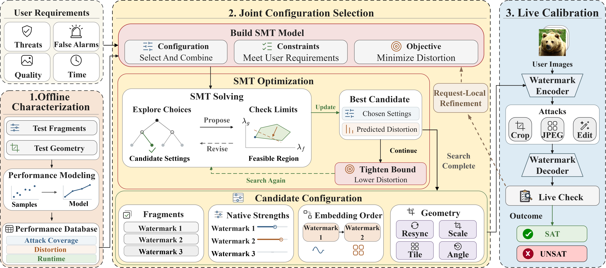

# Made to Measure: Designing Image Watermarks to Specification

You say what a watermark has to do. TAILOR gives you a configuration that does
it, or tells you no configuration can.



A request is four numbers and a list of attacks:

```bash
python solver/watermark_smt_v2.py --attacks jpeg25 crop75 regen --fpr 1e-6 --min_psnr 38 --max_ms 500
```

```
QUERY custom: PSNR>=38.0 ms<=500.0 FPR<=1e-06 (ba>=0.74) bits>=0 ['jpeg25', 'crop75', 'regen']
  VINE(alpha=0.7) + TrustMark   PSNR~38.3dB . 70ms
```

The answer names the fragments, the strength of each, the order to embed them
in, the geometric stage if one is needed, and the PSNR and latency to expect.

## Install

To solve requests you need three packages. The measured database the solver
reads is already in `inputs/`, so there is nothing to download and no GPU.

```bash
pip install z3-solver numpy scipy
python solver/watermark_smt_v2.py --attacks jpeg25 --fpr 1e-2 --min_psnr 42 --max_ms 100
```

To embed, attack and verify real images you also need PyTorch and the models:

```bash
pip install -r requirements.txt
export PYTHONPATH=$PWD:$PWD/solver:$PWD/measurement:$PWD/pipeline
python tools/fetch_models.py
```

## Models

No model is shipped in this repository. Fetch them:

```bash
python tools/fetch_models.py            # the fragments and the regeneration attack, 9.3 GB
python tools/fetch_models.py --check    # list what is installed, download nothing
python tools/fetch_models.py --only sd  # Stable Diffusion, for the regeneration attack
```

VINE is 9 GB of that: its encoder is built on SD-Turbo, which comes with it. Pass
`--only trustmark videoseal regen` to skip it, at 240 MB.

Source trees land in `external/`; weights go to the usual Hugging Face and PyTorch
caches. Downloaded for you:

| Component | Used for |
| --- | --- |
| TrustMark | a fragment |
| VINE | a fragment |
| VideoSeal | a fragment |
| WatermarkAttacker | the `regen`, `rinse2x`, `vaeB` and `vaeC` attacks |
| Stable Diffusion 2.1 | the `regen` and `rinse2x` attacks (`--only sd`) |

The Stable Diffusion repository is gated. Accept the terms on its model page and
run `hf auth login`, or set `TAILOR_SD21` to a local copy. The `vaeB` and `vaeC`
attacks need no model here: compressai fetches its own.

Two you have to place yourself, because there is no public download to point at.
`--check` prints the exact path each one goes to:

| Component | Used for | File |
| --- | --- | --- |
| SyncSeal | the geometric stage that rectifies before decoding | `syncmodel.jit.pt` |
| MaskWM | a baseline, nothing in the method | `D_128bits.pth` |

CtrlRegen and UnMarker conflict with this environment's dependencies, so they
run out of process. Install each in its own environment and point at its
interpreter.

To put anything somewhere else, set the matching variable. `src/paths.py` has
them all in one place.

| Variable | Default |
| --- | --- |
| `TAILOR_MODELS` | `external/` |
| `TAILOR_WORKSPACE` | `workspace/`, where campaigns write |
| `TAILOR_POOL` | `$TAILOR_WORKSPACE/pool` |
| `TAILOR_VINE_REPO`, `TAILOR_VIDEOSEAL_REPO`, `TAILOR_WMATTACKER_REPO` | under `$TAILOR_MODELS` |
| `TAILOR_SYNCSEAL_JIT`, `TAILOR_MASKWM_CKPT` | under `$TAILOR_MODELS` |
| `TAILOR_SD21` | `stabilityai/stable-diffusion-2-1` |
| `TAILOR_CTRLREGEN_PYTHON`, `TAILOR_UNMARKER_PYTHON` | unset |

## Solving requests

| Flag | Meaning |
| --- | --- |
| `--attacks` | the attacks the watermark must survive |
| `--fpr` | the false-positive budget one verification of one image may spend |
| `--min_psnr` | the fidelity floor, in dB |
| `--max_ms` | the latency ceiling, in ms, embedding plus verification |

The 20 attack names:

```
jpeg25  blur  noise  bright  contrast  rs256  hflip  border20
crop75  crop50  rot9  crop_jpeg
vaeB  vaeC  regen  rinse2x
ctrlregen_s03  ctrlregen_s05  ctrlregen_s07  unmarker
```

`--fpr` sets the bit accuracy a verification has to reach, which the query line
prints next to it: `1e-2` asks for 0.63, `1e-6` for 0.74, `1e-9` for 0.80.
Tightening it alone can change the answer, because a configuration that runs
more verification paths has to clear a stricter threshold.

```bash
python solver/watermark_smt_v2.py --attacks jpeg25 regen --fpr 1e-1 --min_psnr 40 --max_ms 300
#   TrustMark   PSNR~41.3dB . 12ms
python solver/watermark_smt_v2.py --attacks jpeg25 regen --fpr 1e-2 --min_psnr 40 --max_ms 300
#   UNSAT
```

`UNSAT` means no configuration in the library satisfies all four inputs at once:

```bash
python solver/watermark_smt_v2.py --attacks jpeg25 crop75 crop50 rot9 regen rinse --fpr 1e-6 --min_psnr 46 --max_ms 200
#   UNSAT - no combination satisfies these conditions
```

Use `--min_ba` instead of `--fpr` to state the bit accuracy directly. Give one
or the other, not both.

## Validating on your own images

The database was measured on one image population, which may not behave like
yours. Live calibration runs the whole embed, attack and decode path on your
images and deploys only what passes there:

```bash
python solver/live_topk_full.py enumerate <class> <n_requests>   # candidates per request
python solver/live_topk_full.py measure   <class> [N=100]        # GPU: embed, attack, decode
python solver/live_topk_full.py walk      <class> [N=100]        # verdicts, no GPU
python solver/live_topk_full.py patch     <class> <shard> <n>    # re-solve what failed
```

`measure` writes one record per configuration and attack under
`$TAILOR_WORKSPACE/live_topk/cells/` and reuses whatever is already there, so
the campaign is resumable and a configuration measured once is free for every
later request that picks it.

## Measuring your own fragments

To characterize a different fragment library, rebuild the database:

```bash
python pipeline/build_wm_dataset.py --out $TAILOR_WORKSPACE/pool   # the image pool
python pipeline/perimage_campaign.py                               # recovery, per image
python pipeline/make_delta_curves.py                               # interference, per ordered pair
python pipeline/make_frontend_components.py                        # the geometric stages
python pipeline/fit_surrogate_curves.py                            # knots to curves
python pipeline/make_canonical_surrogate.py                        # -> inputs/surrogate_canonical.json
```

## Repository layout

```
solver/        the SMT model, the request protocol, the live-calibration loop
measurement/   the verification rule, the FPR accounting, the measurement harness
src/           the fragments, the geometric stages, the attacks, soft decoding
pipeline/      the campaigns that build the database
inputs/        the measured database the solver reads
tools/         fetching the models
```

`inputs/surrogate_canonical.json` is the database: 60 recovery curves over
fragment strength, 120 interference curves per ordered pair and attack, 827
curves for the geometric stages, 181 per-image score sets behind those means,
and the distortion, latency and capacity entries. `inputs/requests.json` holds
the 7,321 requests the paper evaluates.

## Not included

- The image pool. Rebuild it with `pipeline/build_wm_dataset.py`.
- The batch drivers for CtrlRegen and UnMarker, and the `wbench` package the
  editing attacks and the baseline wrappers import. Solving a request against
  `ctrlregen_*` or `unmarker` works, because their measurements are in the
  database; re-measuring those attacks yourself does not.

## License

MIT, see `LICENSE`. The fragments and the attack models stay with their own
projects under their own licenses and are not redistributed here.
